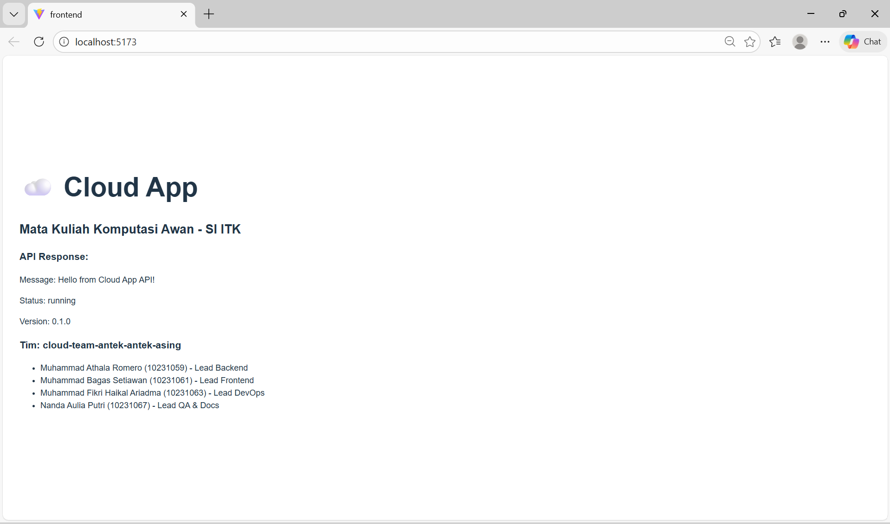

# Cloud App - TickTrack

## Deskripsi Proyek
TickTrack merupakan sistem internal helpdesk berbasis cloud yang dirancang untuk membantu perusahaan dalam mengelola alur pekerjaan internal secara tersturktur dan terdokumentasi. Karyawan dapat membuat serta menyelesaikan tiket pekerjaan seperti maintance, perbaikan perangkat hingga teknis lainnya, serta dapat mempermudah dalam pencatatan dan evaluasi performa karyawan dengan melalui TickTrack. 

Setiap tiket terdapat waktu pembuatan hingga penyelesaian serta seluruh aktivitas kerja yang akan dicatat dan dimonitoring secara sistematis. Dengan sistem TickTrack pekerjaan akan terdokumentasi secara terpusat sehingga supervisor dapat memonitor produktivitas harian serta mengavluasi pencapain KPI. 


## Tim

| Nama | NIM | Peran |
|------|-----|--------|
| Muhammad Athala Romero | 10231059| Lead Backend |
| Muhammad Bagas Setiawan  | 10231061 | Lead Frontend |
|Muhammad Fikri Haikal Ariadma   | 10231063 | Lead DevOps |
| Nanda Aulia Putri | 10231067 | Lead QA & Docs |

## Tech Stack

| Teknologi | Fungsi |
|------------|---------|
| FastAPI | Backend REST API |
| React (Vite) | Frontend SPA |
| PostgreSQL | Database |
| Docker | Containerization|
| GitHub Actions | CI/CD |
| Railway / Render| Cloud Deployment |


## Architecture
```
[Client / User]
       │
     (HTTPS)
       │
       ▼
[React Frontend (Vite)]
       │
   REST API (HTTP)
       │
       ▼
[FastAPI Backend]
 (Authentication & Business Logic)
       │
      SQL
       │
       ▼
[PostgreSQL Database]
 (Data Persistence Layer)
```

## Getting Started

### Prasyarat
- Python 3.10+
- Node.js 18+
- Git

### Backend
```
cd backend  
pip install -r requirements.txt  
uvicorn main:app --reload --port 8000  
```
Untuk menjalankan backend, masuk ke folder backend lalu menginstall seluruh library yang dibutuhkan oleh backend lalu menjalankan server dengan uvicorn main:app --reload --port 8000 sehingga server dapat berjalan 

### Frontend
```
cd frontend  
npm install  
npm run dev  
```
Untuk menjalankan frontend, masuk ke folder frontend, lalu menginstall seluruh library menggunakan npm install. Aplikasi React dapat berjalan dengan menggunakan npm run dev dan terhubung ke backend 

## 📅 Roadmap

| Minggu | Target                    | Status |
|--------|---------------------------|--------|
| 1      | Setup & Hello World       | ✅ |
| 2      | REST API + Database       | ⬜ |
| 3      | React Frontend            | ⬜ |
| 4      | Full-Stack Integration    | ⬜ |
| 5–7    | Docker & Compose          | ⬜ |
| 8      | UTS Demo                  | ⬜ |
| 9–11   | CI/CD Pipeline            | ⬜ |
| 12–14  | Microservices             | ⬜ |
| 15–16  | Final & UAS               | ⬜ |

### Berikut Hasil tampilan dari  endpoint /team 



### Commit setiap anggota 
