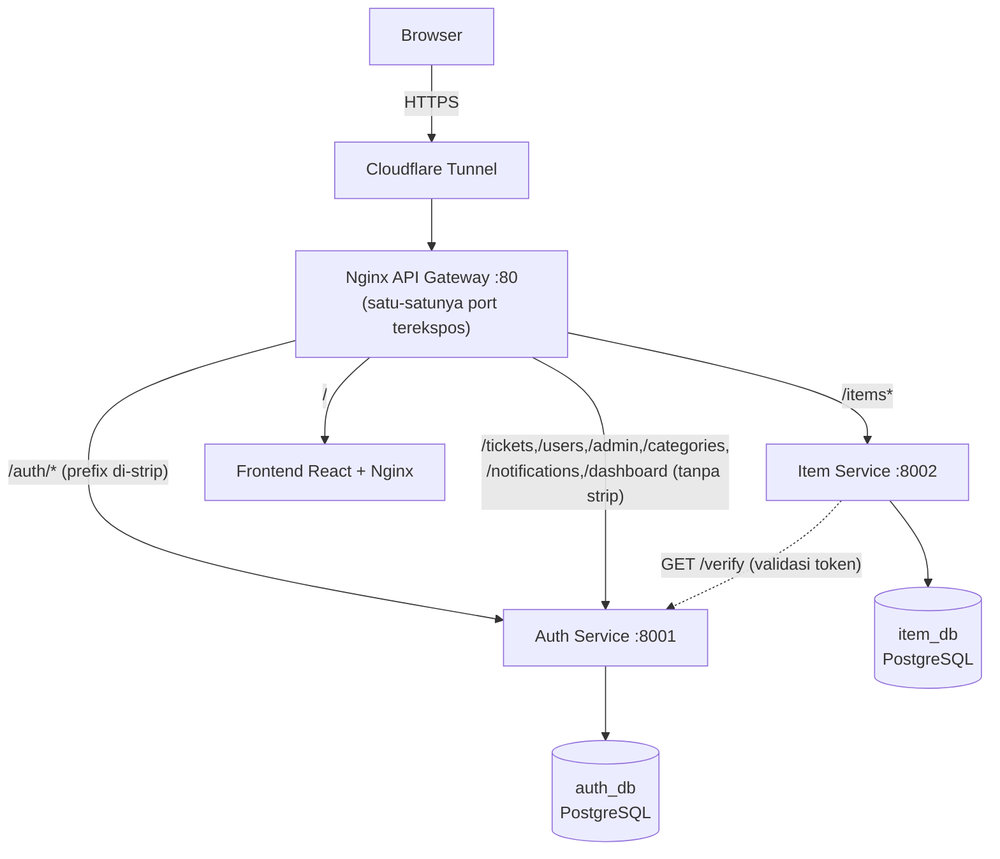

# ☁️ Antick Async — Cloud Helpdesk System


Sistem internal **helpdesk / ticketing** berbasis cloud — dibangun sebagai tugas mata kuliah Cloud Computing (Kelompok A "Antek Antek Asing", ITK). Karyawan membuat tiket pekerjaan (maintenance, perbaikan perangkat, isu teknis), tim IT Support menyelesaikannya, dan admin/superadmin mengelola approval user, departemen, serta memonitor performa lewat dashboard.

## 🛠️ Tech Stack

| Layer | Teknologi |
|---|---|
| **Backend** | FastAPI (Python 3.12), SQLAlchemy ORM, Pydantic v2 + pydantic-settings, slowapi (rate limiting), JWT (python-jose style, HS256), bcrypt |
| **Frontend** | React 19 + Vite 7, react-router-dom 7, Tailwind CSS 3, lucide-react, lottie-react, @splinetool/react-spline (3D scene), Vitest + Testing Library |
| **Database** | PostgreSQL 16 (alpine) — *database-per-service* (`auth_db` & `item_db` terpisah) |
| **Gateway** | Nginx 1.25 (reverse proxy, rate limiting, CORS) |
| **Container** | Docker + Docker Compose (7 services) |
| **CI/CD** | GitHub Actions (`ci.yml`, `health-check.yml`) |
| **Deployment** | VPS lokal + Cloudflare Tunnel (`cloudflared`) — bisa offline kapan saja |

---

## 📑 Table of Contents

- [🌐 Live Demo](#-live-demo)
- [👥 Role & Akses Sistem](#-role--akses-sistem)
- [🚀 Fitur Utama Sistem](#-fitur-utama-sistem)
- [🏗️ Arsitektur Microservices](#️-arsitektur-microservices)
- [🧩 Backend Services](#-backend-services)
- [🔐 Security Features](#-security-features)
- [📈 Monitoring Features](#-monitoring-features)
- [⚡ Quick Start — Clone & Jalankan di Local](#-quick-start--clone--jalankan-di-local)
- [⚙️ Environment Variables (.env)](#️-environment-variables-env)
- [🧭 Mode Development vs Production](#-mode-development-vs-production)
- [🛠️ Makefile & Scripts](#️-makefile--scripts)
- [📚 API Documentation](#-api-documentation)
- [🧪 Testing](#-testing)
- [📄 Dokumentasi Tambahan](#-dokumentasi-tambahan)
- [🩺 Troubleshooting](#-troubleshooting)
- [📅 Roadmap](#-roadmap)
- [📁 Project Structure](#-project-structure)
- [👤 Tim](#-tim)

---

## 🌐 Live Demo

| Service | URL |
|---|---|
| Frontend | [https://antick-async.online](https://antick-async.online) |
| Backend API | [https://api.antick-async.online](https://api.antick-async.online) |
| Health Check | [https://api.antick-async.online/health](https://api.antick-async.online/health) |
| System Status (UI) | [https://antick-async.online/status](https://antick-async.online/status) (admin/superadmin only) |

> Deployed di VPS/laptop tim yang diekspos ke internet via **Cloudflare Tunnel**. Server bisa offline kapan saja — jika tidak dapat diakses, deployment sedang tidak aktif, jalankan saja secara lokal mengikuti [Quick Start](#-quick-start--clone--jalankan-di-local) di bawah.

---

## 👥 Role & Akses Sistem

| Role | Hak Akses |
|---|---|
| **Employee** | Buat & edit tiket sendiri, lihat detail/history tiket sendiri, terima notifikasi status tiket, kelola profil sendiri |
| **IT Support (`it_employee`)** | Lihat & kelola semua tiket: ubah status, assign tiket ke diri sendiri/IT lain, update progress pengerjaan |
| **Admin** | Approve/reject registrasi user baru (assign departemen), kelola departemen & kategori, hapus tiket, lihat approval log. Tidak bisa mengubah role admin/superadmin lain |
| **Superadmin** | Semua akses admin + mengubah role user (kecuali menaikkan ke superadmin), approval tingkat akhir |

Alur user baru: **register → status PENDING → admin/superadmin approve (assign departemen, role otomatis `it_employee` jika departemen IT, selain itu `employee`) atau reject → user bisa login**.

---

## 🚀 Fitur Utama Sistem

1. **Authentication & Approval System**
   - Register dengan validasi email & kekuatan password
   - Login ditolak untuk status `PENDING`/`REJECTED`/akun nonaktif
   - Approval/reject registrasi user oleh admin, dengan notifikasi otomatis ke user
   - JWT (expire 60 menit default), logout & ganti password mem-blacklist token
2. **Ticket Management**
   - Employee membuat & edit tiket sendiri, IT Support mengubah status/assignee
   - Detail tiket lengkap + history status, kategori, prioritas
   - Filter tiket (search, status, priority, assignee) dengan tombol **Apply Filter** & **Reset Filter**
   - Bulk action & reset password user (admin/superadmin), modal konfirmasi kustom untuk semua aksi destruktif
3. **Notification System**
   - Notifikasi tiket baru, approval/reject user, perubahan status tiket
   - Polling otomatis di navbar (notification bell)
4. **Admin & Superadmin Management**
   - Dashboard approval user (pending users), manajemen departemen & kategori
   - Role management, approval log (audit trail)
5. **User Profile**
   - Ubah avatar (10 pilihan), ubah nama/email, ubah password
6. **Dashboard & Monitoring**
   - Dashboard ringkasan tiket, analitik per departemen, response time analytics
   - **System Status** page (`/status`, admin/superadmin only): health check real-time semua service, metrics (request count, error rate, latency, uptime), animasi mood reaktif untuk API Gateway

---

## 🏗️ Arsitektur Microservices


```mermaid
flowchart TD
    A[Browser] -->|HTTPS| B[Cloudflare Tunnel]
    B --> C["Nginx API Gateway :80<br/>(satu-satunya port terekspos)"]

    C -->|"/auth/* (prefix di-strip)"| G[Auth Service :8001]
    C -->|"/tickets,/users,/admin,/categories,<br/>/notifications,/dashboard (tanpa strip)"| G
    C -->|"/items*"| H[Item Service :8002]
    C -->|"/"| I[Frontend React + Nginx]

    G --> J[("auth_db<br/>PostgreSQL")]
    H --> K[("item_db<br/>PostgreSQL")]
    H -.->|"GET /verify (validasi token)"| G
```

- **auth-service** memegang lebih dari sekadar auth: **users, departments, categories, tickets, notifications, approval logs, dashboard**.
- **item-service** memvalidasi token dengan memanggil `auth-service` secara internal (`GET /verify`); `items.owner_id` menyimpan user id tanpa foreign key (database terpisah).
- **gateway** (Nginx): rate limit `/auth/*` 5r/s, `/items*` 20r/s, umum 30r/s. CORS whitelist domain produksi + `localhost:*`.
- `backend/` di root repo adalah **monolith legacy** (minggu 1–11) — masih dipertahankan karena CI menjalankan pytest terhadap folder ini, tapi **kode aktif/fitur baru ada di `services/`**.

---

## 🧩 Backend Services

| Service | Port internal | Tanggung jawab |
|---|---|---|
| **auth-service** | 8001 | Auth, users, departments, categories, tickets, notifications, approval, dashboard |
| **item-service** | 8002 | CRUD items/inventory, validasi token via auth-service |
| **gateway** | 80 (exposed) | Reverse proxy, rate limiting, CORS |

---

## 🔐 Security Features

- **JWT Authentication** — akses resource dilindungi token, expire 60 menit (configurable)
- **Role-based Access Control (RBAC)** — pembatasan rute berdasarkan role (lihat [tabel role](#-role--akses-sistem))
- **Rate Limiting** — Nginx Gateway membatasi request per detik (`5r/s` auth, `20r/s` items, `30r/s` umum) untuk mencegah brute force & DoS
- **Input Validation** — Pydantic schema (panjang string, regex password, integer constraints)
- **Secret Management** — semua secret lewat `.env` (gitignored), **fail-fast** saat startup jika `SECRET_KEY` kosong/terlalu pendek (<32 karakter)
- **Password hashing** — bcrypt, reset password admin men-set flag `must_change_password`

## 📈 Monitoring Features

- **Structured Logging** — JSON-compatible log format di semua service, dengan correlation ID
- **Metrics Endpoint** — `GET /metrics` di tiap service: request count, **error rate (hanya status ≥500, kegagalan sistem nyata — bukan 4xx wajar seperti login salah)**, latency (avg/p50/p95/p99), uptime
- **Health Checks** — `GET /health` di tiap service + Docker Compose healthcheck chain
- **System Status Dashboard** (`/status`, frontend) — real-time, auto-refresh 10 detik, animasi visual status API Gateway

---

## ⚡ Quick Start — Clone & Jalankan di Local

### Prasyarat

- [Docker Desktop](https://www.docker.com/products/docker-desktop/) (sudah jalan)
- [Node.js](https://nodejs.org/) 20+ & npm (untuk build frontend)
- Git

### 1. Clone repository

```bash
git clone https://github.com/aidilsaputrakirsan-classroom/cc-kelompok-a-antek-antek-asing.git
cd cc-kelompok-a-antek-antek-asing
```

### 2. Siapkan file `.env`

```bash
cp .env.example .env
```

Edit `.env` dan isi minimal:

| Variabel | Wajib diisi? | Keterangan |
|---|---|---|
| `SECRET_KEY` | **Wajib** | Random string ≥32 karakter. Generate: `python -c "import secrets; print(secrets.token_urlsafe(32))"`. Tanpa ini, `auth-service` akan **gagal start** (fail-fast). |
| `SUPERADMIN_PASSWORD` | **Wajib** | Password untuk akun superadmin yang di-seed otomatis saat startup. Jangan pakai nilai default `Superadmin123!` (ditolak validator). |
| `CORS_ORIGINS` | Wajib (sudah ada default) | **Format JSON array**, contoh: `["http://localhost:5173","http://localhost:3000"]`. ⚠️ Format comma-separated (`a,b,c`) akan membuat `auth-service` gagal start — `pydantic-settings` men-JSON-decode field ini sebelum validator custom jalan. |
| `POSTGRES_PASSWORD` | Opsional | Default dev `postgres123` kalau dikosongkan |
| `TUNNEL_TOKEN` | Opsional (lokal) | Hanya perlu kalau ingin expose ke internet via Cloudflare Tunnel — kosongkan/biarkan placeholder untuk dev lokal biasa |
| `SMTP_*` | Opsional | Untuk fitur notifikasi email (belum sepenuhnya terpasang di semua flow) |

### 3. Build frontend (wajib sebelum Docker)

Frontend **tidak di-build di dalam Docker** (image cuma `COPY dist`, untuk menghindari OOM di VPS kecil) — build manual dulu:

```bash
cd frontend
npm install
npm run build:dev   # build untuk testing LOKAL — lihat catatan di bawah
cd ..
```

> ⚠️ **Penting soal mode build**: `frontend/.env.production` sudah berisi
> `VITE_API_URL=https://api.antick-async.online` (domain live tim) — dipakai saat deploy
> ke server tim yang sungguhan online. Untuk **testing 100% lokal** (gateway sendiri di
> `localhost:80`, belum terhubung Cloudflare Tunnel), pakai `npm run build:dev`
> (mode `development`, tidak memuat `.env.production`) agar frontend otomatis fallback ke
> `http://localhost` (lihat `frontend/src/services/api.js`). Kalau memang sedang men-deploy
> ulang ke server tim yang live, baru gunakan `npm run build` biasa.

### 4. Jalankan seluruh stack dengan Docker Compose

```bash
docker compose up --build -d
```

Tunggu sampai semua container `healthy` (urutan: `auth-db`/`item-db` → `auth-service`/`item-service` → `gateway`):

```bash
docker compose ps
# atau
make status
```

### 5. Verifikasi

```bash
curl http://localhost/health         # gateway
curl http://localhost/auth/health    # auth-service
curl http://localhost/items/health   # item-service
```

Buka **http://localhost** di browser. Login dengan akun superadmin yang otomatis di-seed:

- Email: `superadmin@admin.com` (atau sesuai `SUPERADMIN_EMAIL` di `.env`)
- Password: sesuai `SUPERADMIN_PASSWORD` di `.env`

> Login pertama akan meminta ganti password (`must_change_password`).

### 6. (Opsional) Hot-reload frontend selama development

Stack Docker di atas menyajikan frontend versi *build* (static). Untuk hot-reload saat mengembangkan UI:

```bash
cd frontend
npm run dev          # jalan di http://localhost:5173, tetap hit API via gateway port 80
```

Setiap kali selesai mengubah frontend dan ingin perubahan tampil di stack Docker (bukan hanya `npm run dev`), ulangi langkah 3 (`npm run build:dev` untuk lokal, atau `npm run build` untuk server live) lalu `docker compose build frontend && docker compose up -d frontend`.

---

## ⚙️ Environment Variables (.env)

Semua environment variable ada di **satu file `.env` di root repo** (bukan per-service) — dibaca oleh `docker-compose.yml` lewat `env_file` dan variable substitution `${...}`. Template lengkap: [`.env.example`](.env.example).

```ini
# ---- GENERAL ----
ENVIRONMENT=development
LOG_LEVEL=INFO

# ---- DATABASE ----
POSTGRES_PASSWORD=postgres123

# ---- JWT / AUTH ----
SECRET_KEY=ganti-dengan-random-string-panjang-minimal-32-karakter
ALGORITHM=HS256
ACCESS_TOKEN_EXPIRE_MINUTES=60

# ---- CORS (format JSON array, bukan comma-separated!) ----
CORS_ORIGINS=["http://localhost:5173","http://localhost:3000"]

# ---- SUPERADMIN AWAL ----
SUPERADMIN_EMAIL=superadmin@admin.com
SUPERADMIN_PASSWORD=GantiDenganPasswordKuat123!

# ---- SMTP (opsional) ----
SMTP_HOST=smtp.hostinger.com
SMTP_PORT=587
SMTP_USER=
SMTP_PASSWORD=
MAIL_FROM=
MAIL_FROM_NAME=Antick Async IT Support

# ---- CLOUDFLARE TUNNEL (rahasia, hanya untuk deployment publik) ----
TUNNEL_TOKEN=
```

⚠️ **Jangan pernah commit `.env`** (sudah di-`.gitignore`). File `frontend/.env.production` boleh di-commit karena hanya berisi URL publik (`VITE_API_URL`, dll), bukan secret.

---

## 🧭 Mode Development vs Production

| Mode | Command | Karakteristik |
|---|---|---|
| **Production-style (default)** | `docker compose up --build -d` | Semua 7 service jalan, hanya gateway terekspos, sesuai deployment live |
| **Development (hot-reload backend)** | `make dev` | `docker-compose.dev.yml` override: hot-reload uvicorn untuk auth-service & item-service, port debug terekspos (8001/8002, DB 5433/5434), `cloudflared` dimatikan |
| **Production eksplisit** | `make prod` | Base compose + penegasan `ENVIRONMENT=production`/`LOG_LEVEL=INFO` (`docker-compose.prod.yml`) |
| **Frontend dev (hot-reload UI)** | `cd frontend && npm run dev` | Port 5173, lepas dari Docker, tetap panggil API via gateway `:80` |

---

## 🛠️ Makefile & Scripts

```bash
make up            # start tanpa rebuild
make build          # rebuild semua image + start
make dev            # mode development (hot-reload, tanpa cloudflared)
make prod           # mode production eksplisit
make down           # stop & remove container (volume tetap)
make clean          # stop + hapus volume (⚠️ semua data hilang!)
make logs           # logs semua service (follow)
make logs-auth      # logs auth-service saja
make ps             # status container
make health         # cek gateway /health
make status         # ringkasan status + health gateway/auth/item
make shell-auth      # shell ke container auth-service
make shell-auth-db   # psql ke auth_db
```

Script tambahan di `scripts/`:

- `verify-deployment.sh [base-url]` — verifikasi menyeluruh (container, health, metrics, auth guard) untuk lokal/production
- `migrate_data.py` — migrasi data dari monolith lama (`backend/`) ke microservices (`services/`), idempotent
- `wait-for-db.sh`, `logs.sh`, `docker-run.sh` — helper operasional

---

## 📚 API Documentation

Dokumentasi interaktif OpenAPI (Swagger) via gateway:

- **Auth Service**: `http://localhost/auth/docs`
- **Item Service**: `http://localhost/items/docs`

Ringkasan endpoint utama (lengkap di `docs/api-contract.md`):

| Area | Endpoint |
|---|---|
| Auth | `POST /auth/register`, `POST /auth/login`, `GET/PUT /auth/me`, `POST /auth/change-password` |
| Users/Admin | `GET /users`, `PUT /users/{id}/role`, `POST /admin/users/{id}/reset-password`, `DELETE /admin/users/{id}`, `GET /admin/pending-users`, `POST /admin/approve-user/{id}`, `POST /admin/reject-user/{id}` |
| Departments | `GET/POST/PUT/DELETE /admin/departments` |
| Tickets | `POST/GET /tickets`, `GET /tickets/{id}`, `PUT /tickets/{id}/employee`, `PUT /tickets/{id}/admin`, `DELETE /tickets/{id}` |
| Categories | `GET/POST /categories`, `PUT/DELETE /categories/{id}` |
| Notifications | `GET /notifications`, `PUT /notifications/{id}/read`, `PUT /notifications/read-all` |
| Dashboard | `GET /dashboard`, `/dashboard/department-analytics`, `/dashboard/response-time-analytics` |
| Items | `GET/POST /items`, `GET /items/stats`, `GET/PUT/DELETE /items/{id}` |
| Health/Metrics | `GET /health`, `/auth/health`, `/auth/metrics`, `/items/health`, `/items/metrics` |

---

## 🧪 Testing

```bash
# Backend (legacy monolith — target pytest CI)
cd backend
pip install -r requirements.txt
pytest --cov

# Frontend
cd frontend
npm test            # Vitest, sekali jalan
npm run test:watch  # mode watch
npm run build        # pastikan build production tetap sukses
```

CI (`ci.yml`) menjalankan: pytest `backend/` (coverage ≥50%), Vitest + `vite build` di `frontend/`, lalu `docker compose build` (hanya jika kedua test lolos).

| Area | Test Case | Status |
|---|---|---|
| Auth | Register, login valid, login invalid (ditolak + pesan error) | ✅ |
| Items CRUD | Add, get, update, delete, validasi input kosong/format salah | ✅ |
| Frontend | 19 test (Vitest) — components, error handling, API client | ✅ |

---

## 📄 Dokumentasi Tambahan

- [CLAUDE.md](CLAUDE.md) — konteks lengkap project untuk AI agent (arsitektur, schema DB, kredensial dev, instruksi tim)
- [CHANGELOG.md](CHANGELOG.md) — riwayat seluruh perubahan sistem
- [Testing Guide](docs/testing-guide.md)
- [Reliability Testing Report](<docs/reliability-testing%20.md>)
- [UI Testing Documentation](docs/testing-ui-projek.md)
- [UI Test Results](docs/ui-test-results.md)
- [API Contract Documentation](docs/api-contract.md)
- [Operations Guide](docs/operations-guide.md)
- [Architecture Detail](docs/architecture.md)
- [Deployment Guide](docs/deployment-guide.md)

---

## 🩺 Troubleshooting

| Masalah | Solusi |
|---|---|
| `auth-service` crash-loop / unhealthy saat `docker compose up` | Cek `.env`: `SECRET_KEY` kosong atau `CORS_ORIGINS` bukan format JSON array (lihat [Quick Start langkah 2](#2-siapkan-file-env)) |
| Tampilan frontend tidak sesuai kode terbaru | `frontend/dist` belum di-rebuild — jalankan ulang `npm run build:dev` (lokal) lalu `docker compose build frontend && docker compose up -d frontend` |
| Frontend lokal malah memanggil API production tim (`api.antick-async.online`) | Build terakhir pakai `npm run build` (mode production, ikut `.env.production`) — untuk lokal, pakai `npm run build:dev` |
| `docker compose ps` menunjukkan `gateway` tidak pernah `healthy` | Cek healthcheck pakai `127.0.0.1` bukan `localhost` (masalah resolusi IPv6) — sudah di-fix di `docker-compose.yml`, pastikan repo up to date |
| Login gagal terus walau password benar | Pastikan status user `ACTIVE` (bukan `PENDING`/`REJECTED`) — perlu di-approve admin dulu setelah register |
| Ingin reset semua data lokal | `make clean` (⚠️ menghapus volume database — semua data hilang) lalu `docker compose up --build -d` lagi |

---

## 📅 Roadmap

| Minggu | Target | Status |
|---|---|---|
| 1–4 | Setup, REST API + DB, React, integrasi full-stack + JWT | ✅ |
| 5–7 | Docker & Compose | ✅ |
| 8 | UTS Demo | ✅ |
| 9–11 | CI/CD Pipeline | ✅ |
| 12–14 | Microservices (auth/item split, gateway, observability) | ✅ |
| 15–16 | Final & UAS (security hardening, polish UI, dokumentasi) | ✅ |

---

## 📁 Project Structure

```
cc-kelompok-a-antek-antek-asing/
├── .github/
│   ├── workflows/                  # CI (ci.yml) & health-check.yml
│   └── CODEOWNERS
├── backend/                        # Monolith legacy (target pytest CI, bukan kode aktif)
├── docs/                           # Dokumentasi tim (testing, ops, api-contract, dll)
├── frontend/                       # React + Vite SPA
│   ├── public/
│   │   └── lottie/                 # Animasi Lottie (System Status)
│   └── src/
│       ├── components/             # Komponen UI reusable
│       ├── context/                # AuthContext, ConfirmContext, ThemeContext, dll
│       ├── hooks/                  # useAuth, useNotifications, dll
│       ├── layouts/                # AppShell (sidebar + header)
│       ├── pages/                  # AdminDashboardPage, StatusPage, ItemsPage, dll
│       ├── routes/                 # ProtectedRoute, PublicRoute
│       └── services/                # api.js (HTTP client ke gateway)
├── scripts/                        # Helper shell/python (migrasi, verifikasi, logs)
├── services/                       # Microservices aktif
│   ├── auth-service/                # main.py, models.py, schemas.py, crud.py, auth.py, config.py
│   ├── item-service/                # main.py, models.py, schemas.py, auth_client.py
│   ├── gateway/nginx.conf            # Routing + rate limit + CORS
│   └── shared/                      # Master copy logging & metrics (disinkron manual ke 2 service)
├── .env.example
├── CHANGELOG.md
├── CLAUDE.md
├── docker-compose.yml
├── docker-compose.dev.yml
├── docker-compose.prod.yml
├── Makefile
└── README.md
```

---

## 👤 Tim

| Nama | NIM | Peran | Area Tanggung Jawab |
|---|---|---|---|
| Muhammad Athala Romero | 10231059 | Lead Backend | `/backend/`, `/services/auth-service/`, `/services/item-service/` |
| Muhammad Bagas Setiawan | 10231061 | Lead Frontend | `/frontend/` |
| Muhammad Fikri Haikal Ariadma | 10231063 | Lead DevOps | `docker-compose*.yml`, Dockerfile, `Makefile`, CI/CD |
| Nanda Aulia Putri | 10231067 | Lead QA & Docs | `README.md`, `/docs/` |
