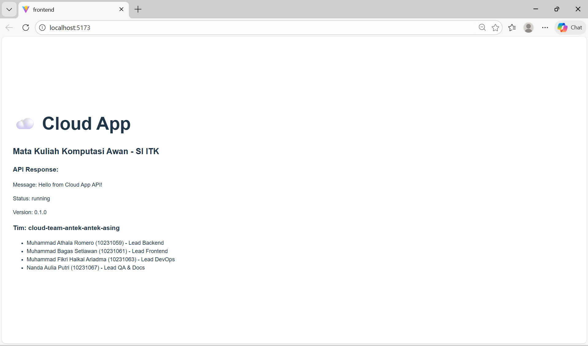

# ☁️  Cloud App - Antick Async


## Deskripsi Proyek
Antick Async merupakan sistem internal helpdesk berbasis cloud yang dirancang untuk membantu perusahaan dalam mengelola alur pekerjaan internal secara tersturktur dan terdokumentasi. Karyawan dapat membuat serta menyelesaikan tiket pekerjaan seperti maintance, perbaikan perangkat hingga teknis lainnya, serta dapat mempermudah dalam pencatatan dan evaluasi performa karyawan dengan melalui Antick Async. 

Setiap tiket terdapat waktu pembuatan hingga penyelesaian serta seluruh aktivitas kerja yang akan dicatat dan dimonitoring secara sistematis. Dengan adanya sistem Antick Async, perusahaan dapat meningkatkan transparansi operasional, serta memastikan setiap tugas akan terdokumentasi secara terpusat sehingga supervisor dapat memonitor produktivitas harian serta mengevaluasi pencapain KPI secara lebih objektif dan berbasis data. 


## Tim

| Nama | NIM | Peran |
|------|-----|--------|
| Muhammad Athala Romero | 10231059| Lead Backend |
| Muhammad Bagas Setiawan  | 10231061 | Lead Frontend |
|Muhammad Fikri Haikal Ariadma   | 10231063 | Lead DevOps |
| Nanda Aulia Putri | 10231067 | Lead QA & Docs |

## 🛠️ Tech Stack

| Teknologi | Fungsi |
|------------|---------|
| FastAPI | Backend REST API |
| React (Vite) | Frontend SPA |
| PostgreSQL | Database |
| Docker | Containerization|
| GitHub Actions | CI/CD |
| Railway / Render| Cloud Deployment |


## 🏗️ Architecture
```
[Client / User]
       │
     (HTTPS)
       │
       ▼
[React Frontend (Vite)]
       │
   REST API (HTTP)
       │
       ▼
[Python Backend]
 (FastAPI/Django)
       │
       ▼
[Database]
 (PostgreSQL/MYSQL)
```

**Penjelasan Arsitektur**

Client/user pengguna dapat mengakses aplikasi TickTrack melalui browser menggunakan protokol HTTPS agar memastikan komunikasi aman. 

React Frontend (Vite) berfungsi usebagai antarmuka pengguna dengan menampilakn dashboard, form input ticket, monitoring performa serta berkomunikasi dengan backend untuk mengambil dan mengirim data

Python Backend berfungsi dalam menjalankan logika bisnis aplikasi seperti autentifikasi pengguna, CRUD tiket, serta perhitungan KPI.

PostgreSQL Database berfungsi untuk menyimpan data terstruktur seperti data pengguna, data tiket, status pekerjaan serta riwayat aktivitas.

## 🚀 Getting Started

### Prasyarat
- Python 3.10+
- Node.js 18+
- Git

### Backend
```
cd backend  
pip install -r requirements.txt  
uvicorn main:app --reload --port 8000  
```
Untuk menjalankan backend, masuk ke folder backend lalu menginstall seluruh library yang dibutuhkan oleh backend. Setelan menginstall  maka uvicorn main:app --reload --port 8000  menjalankan server sehingga server dapat berjalan 

### Frontend
```
cd frontend  
npm install  
npm run dev  
```
Untuk menjalankan frontend, masuk ke folder frontend, lalu menginstall seluruh library menggunakan npm install. Aplikasi React dapat berjalan dan terhubung ke backend 


### Berikut Hasil tampilan frontend yang menampilkan response dari backend API



## Dokumentasi Hasil Pengujian API 
Base URL 
```
http://localhost:8000
```
Swagger UI
```
http://localhost:8000/docs
```
### 1. **POST /items**

Pada Endpoint ini digunakan menambahkan item baru ke database

```
{
"name": "Laptop",
"price": 15000000,
"description": "Laptop untuk cloud computing",
"quantity": 5
}
```
Status Response 
```
201 Created
``` 

URL 
```
http://127.0.0.1:8000/items

```
### 2. **GET /items**

Pada Endpoint ini digunakan untuk menampilkan daftar item 

```
{
  "total": 0,
  "items": [
    {
      "name": "Laptop",
      "description": "Laptop untuk cloud computing",
      "price": 15000000,

```
Status Response 
```
200 OK
``` 

URL 
```
http://127.0.0.1:8000/items

```
### 3. **GET /items/1**

Pada Endpoint ini digunakan untuk mengembalikan detail item dengan id =1 

```
{
  "name": "Laptop",
  "description": "Laptop untuk cloud computing",
  "price": 15000000,
  "quantity": 5,
  "id": 1,
  "created_at": "2026-03-07T06:41:33.175Z",
  "updated_at": "null"
}
```
Status Response 
```
200 OK
``` 

URL 
```
http://127.0.0.1:8000/items/1

```
### 4. **PUT/items/1**

Pada Endpoint ini digunakan untuk memperbarui Data Item.
```
  "name": "Laptop",
  "description": "Laptop untuk cloud computing",
  "price": 14000000,
  "quantity": 5,
  "id": 1,
```
Status Response 
```
200 OK
``` 

URL 
```
http://127.0.0.1:8000/items/1

```

### 5. ** GET /items/1**

Pada Endpoint ini digunakan untuk menampilkan kembali data item setelah dilakukan update.
```
  "name": "Laptop",
  "description": "Laptop untuk cloud computing",
  "price": 14000000,
  "quantity": 5,
  "id": 1,
```
Status Response 
```
200 OK
``` 

URL 
```
http://127.0.0.1:8000/items/1

```
### 6. **GET/items?search=laptop**

Endpoint ini digunakan untuk mencari item berdasarkan kata kunci tertentu.
```
  "name": "Laptop",
  "description": "Laptop untuk cloud computing",
  "price": 14000000,
  "quantity": 5,
  "id": 1,
```
Status Response 
```
200 OK
``` 

URL 
```
http://127.0.0.1:8000/items/1?search=laptop

```

### 7. **DELETE/items/1**

Endpoint ini digunakan untuk menghapus item dari database

Status Response 
```
204
``` 
URL 
```
http://127.0.0.1:8000/items/1

```

### 8. **GET/items/1**

Endpoint ini  memastikan bahwa item yang telah dihapus tidak lagi tersedia di database.
```
"detail: "Item dengan id=1 tidak ditemukan"
```
Status Response 
```
404 Not Found
``` 
URL 
```
http://127.0.0.1:8000/items/1

```

### 9. **GET/items/stats**

Manampilkan statistik item 
Status Response 
```
404 Not Found
``` 
URL 
```
http://127.0.0.1:8000/items/stats

```
## 📅 Roadmap

| Minggu | Target                    | Status |
|--------|---------------------------|--------|
| 1      | Setup & Hello World       | ✅ |
| 2      | REST API + Database       | ✅ |
| 3      | React Frontend            | ⬜ |
| 4      | Full-Stack Integration    | ⬜ |
| 5–7    | Docker & Compose          | ⬜ |
| 8      | UTS Demo                  | ⬜ |
| 9–11   | CI/CD Pipeline            | ⬜ |
| 12–14  | Microservices             | ⬜ |
| 15–16  | Final & UAS               | ⬜ |


📁 Project Structure
```
CC-KELOMPOK-A-ANTEK-ANTEK-ASING
│
├── backend
│   ├── __pycache__
│   ├── env
│   ├── .env.example
│   ├── crud.py
│   ├── database.py
│   ├── main.py
│   ├── models.py
│   ├── requirements.txt
│   ├── schemas.py
│   └── test.db
│
├── docs
│   ├── assets
│   │   └── pictures
│   │       ├── commit.png
│   │       └── hasil.png
│   │
│   ├── member-Muhammad-Athala-Romero.md
│   ├── member-Muhammad-Bagas-Setiawan.md
│   ├── member-Muhammad-Fikri-Haikal.md
│   ├── member-Nanda-Aulia-Putri.md
│   └── test.md
│
├── frontend
│   ├── .vite
│   │   └── deps
│   │       ├── _metadata.json
│   │       └── package.json
│   │
│   ├── node_modules
│   ├── public
│   ├── src
│   ├── .gitignore
│   ├── eslint.config.js
│   ├── index.html
│   ├── package-lock.json
│   ├── package.json
│   ├── README.md
│   └── vite.config.js
│
└── .gitignore
```