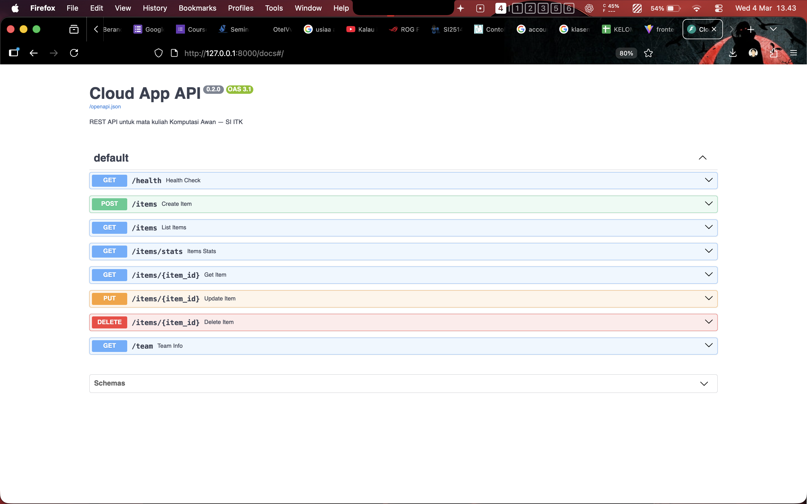
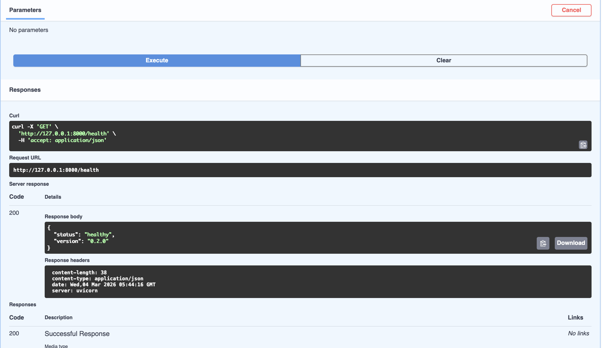
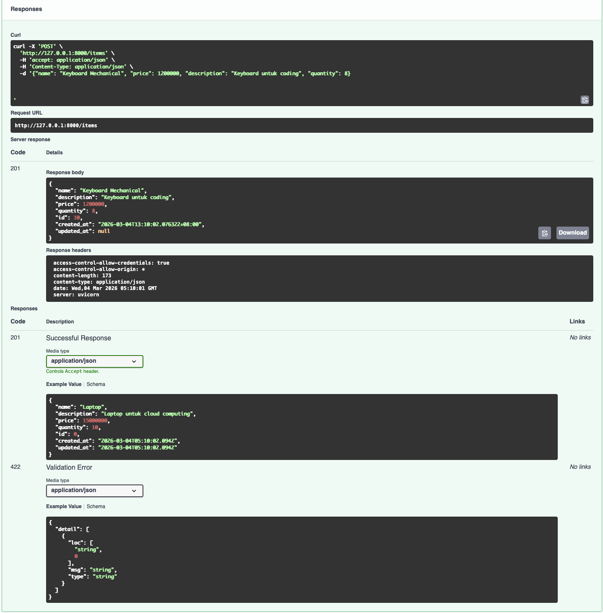
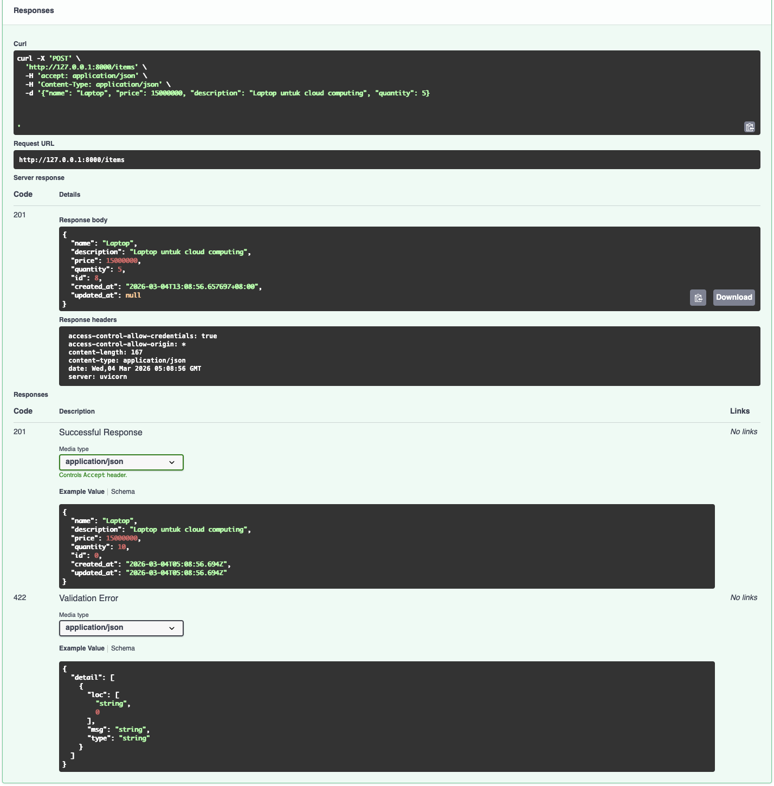
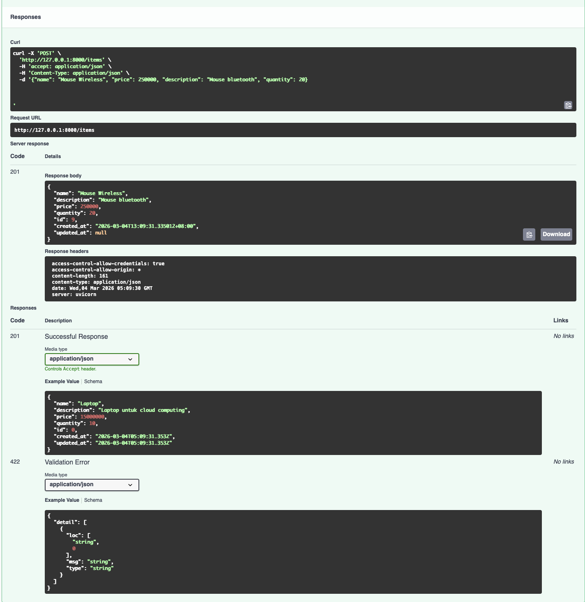
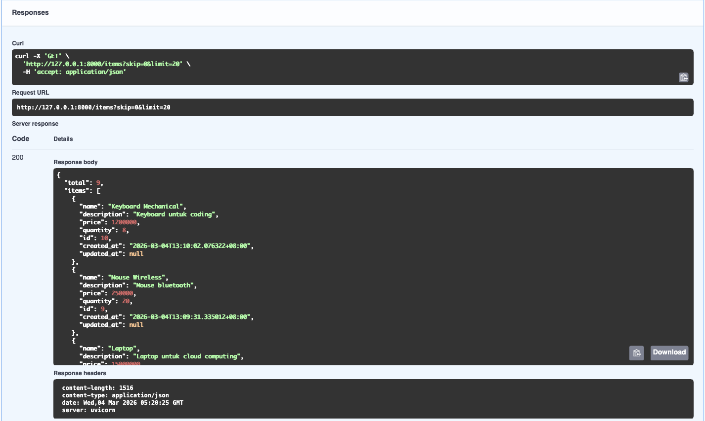
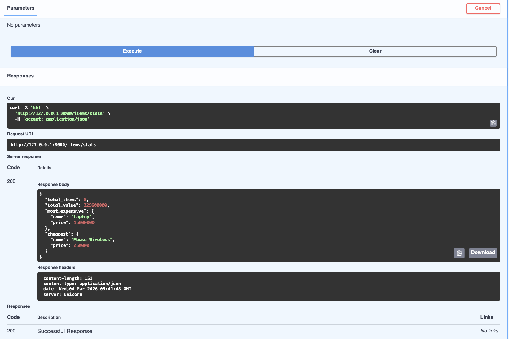
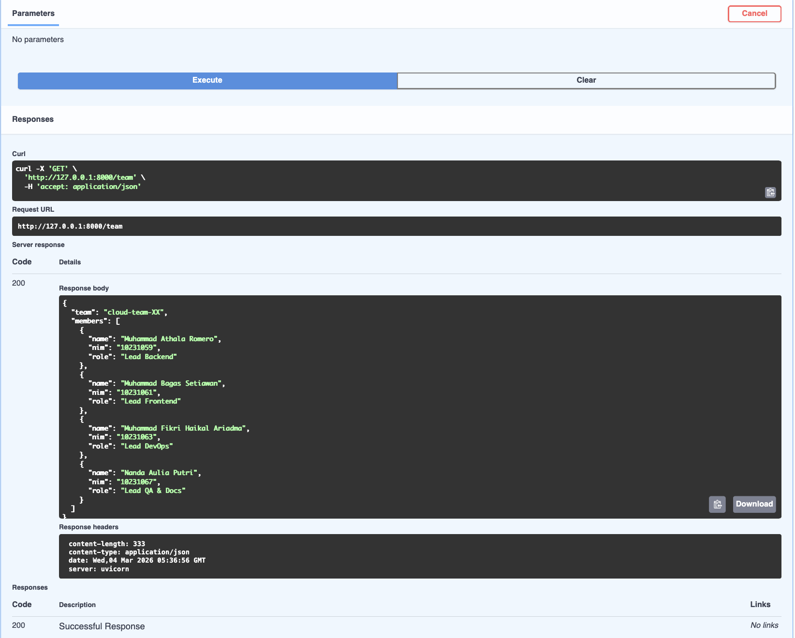

# API Test Results

Pengujian dilakukan menggunakan Swagger UI pada:
http://127.0.0.1:8000/docs

---

## 1. GET /health
Status: 200 OK  
Hasil: API berjalan dengan baik.

---

## 2. POST /items
Status: 201 Created  
Hasil: Item berhasil ditambahkan ke database.

---

## 3. GET /items
Status: 200 OK  
Hasil: Daftar item berhasil ditampilkan.

---

## 4. GET /items/stats
Status: 200 OK  
Hasil: Statistik inventory berhasil ditampilkan (total_items, total_value, most_expensive, cheapest).

---

## 5. GET /items/{item_id}
Status: 200 OK  
Hasil: Detail item berhasil ditampilkan.

.png)

---

## 6. PUT /items/{item_id}
Status: 200 OK  
Hasil: Data item berhasil diperbarui.

.png)

---

## 7. DELETE /items/{item_id}
Status: 204 No Content  
Hasil: Item berhasil dihapus.

.png)

---

## 8. GET /team
Status: 200 OK  
Hasil: Informasi tim berhasil ditampilkan.

---

## Kesimpulan

Semua endpoint berhasil diuji dan berjalan sesuai spesifikasi tanpa error.