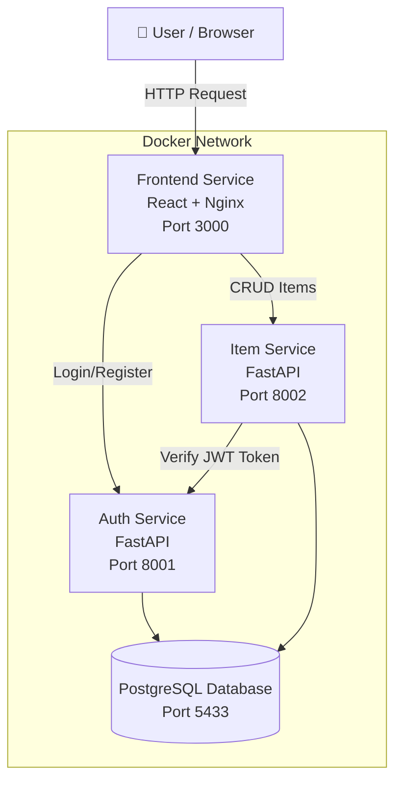

# Microservices Architecture — Antick Async

Dokumentasi ini menjelaskan arsitektur microservices pada aplikasi Antick Async seperti diagram arsitektur, daftar service, API contract, cara menjalankan aplikasi secara lokal, dan cara debugging setiap service.


Arsitektur ini bertujuan untuk:

- meningkatkan scalability
- mempermudah maintenance
- mengurangi coupling antar module
- mempermudah deployment dan testing
- mendukung pengembangan terpisah antar tim

<br> 

##  Architecture Diagram



<br>

## Services & Ports

| Service | Port | Teknologi | Fungsi |
|---|---|---|---|
| Frontend | 3000 | React + Nginx | User interface aplikasi |
| Auth Service | 8001 | FastAPI | Authentication & JWT management |
| Item Service | 8002 | FastAPI | CRUD item dan inventory management |
| PostgreSQL | 5433 | PostgreSQL | Penyimpanan data aplikasi |

<br>

## Auth Service

Auth Service bertanggung jawab untuk:

- registrasi user
- login user
- generate JWT token
- verifikasi token
- autentikasi antar service

<br> 
Auth Service API Contract

| Method | Endpoint | Deskripsi |
|---|---|---|
| POST | `/register` | Registrasi user baru |
| POST | `/login` | Login dan mendapatkan JWT token |
| GET | `/verify` | Verifikasi JWT token |
| GET | `/health` | Health check service |

<br>

## Item Service

Item Service bertanggung jawab untuk:

- create item
- read item
- update item
- delete item
- inventory statistics

<br>

## Item Service API Contract

| Method | Endpoint | Deskripsi |
|---|---|---|
| GET | `/items` | Ambil daftar item |
| POST | `/items` | Tambah item |
| GET | `/items/stats` | Statistik inventory |
| GET | `/items/{id}` | Ambil detail item |
| PUT | `/items/{id}` | Update item |
| DELETE | `/items/{id}` | Hapus item |
| GET | `/health` | Health check service |

<br>

## Inter-Service Communication

Item Service tidak memvalidasi JWT token secara langsung sehingga sebagai Item Service melakukan HTTP request ke Auth Service menggunakan httpx melalui file
services/item-service/auth_client.py

Flow melakukan autentikasi:

1. User login ke Auth Service
2. Auth Service mengembalikan JWT token
3. Frontend mengirim token ke Item Service
4. Item Service memanggil endpoint `/verify` di Auth Service
5. Auth Service memvalidasi token
6. Item Service menerima data user dan memproses request

Pendekatan ini membantu menjaga separation of concerns antar service.

<br>


## Cara menjalankan Secara Lokal

## 1. Clone Repository

```bash
git clone <repository-url>
cd <repository-folder>
```

---

## 2. Jalankan Docker Compose

```bash
docker compose up --build
```

Atau menjalankan di background:

```bash
docker compose up -d
```

---

## 3. Cek Status Container

```bash
docker compose ps
```

---

## 4. Akses Application

| Service | URL |
|---|---|
| Frontend | http://localhost:3000 |
| Auth Service | http://localhost:8001 |
| Item Service | http://localhost:8002 |


## Health Check

## Auth Service

```bash
curl http://localhost:8001/health
```

## Item Service

```bash
curl http://localhost:8002/health
```
<br>

## Debugging Per Service

## Melihat Semua Logs

```bash
docker compose logs -f
```

---

## Logs Auth Service

```bash
docker compose logs auth-service
```

---

## Logs Item Service

```bash
docker compose logs item-service
```

---

## Logs Frontend

```bash
docker compose logs frontend
```

---

## Restart Service

```bash
docker compose restart auth-service
```

```bash
docker compose restart item-service
```
