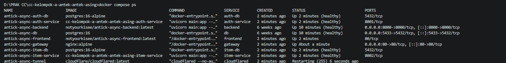
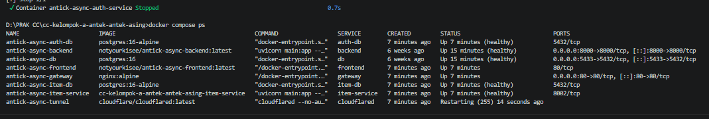
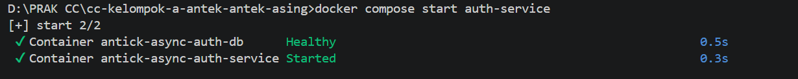

# Reliability Testing Documentation
<br>


Dokumentasi  Realibility Testing menjelaskan pada pengujian reliability pada arsitektur microservices yang digunakan dalam aplikasi Antick Async. Pengujian dilakukan untuk memastikan sistem tetap stabil, tersedia, dan mampu menangani gangguan layanan tanpa menyebabkan kegagalan pada keseluruhan sistem.

Pengujian difokuskan pada kemampuan sistem dalam menangani kegagalan layanan autentikasi (Auth Service), mempertahankan layanan lain tetap berjalan, serta melakukan pemulihan layanan setelah gangguan diatasi.

<br>


# Test Environment

| Component         | Technology     |
| ----------------- | -------------- |
| Frontend          | React          |
| API Gateway       | Nginx          |
| Auth Service      | FastAPI        |
| Item Service      | FastAPI        |
| Database          | PostgreSQL     |
| Container Runtime | Docker Desktop |
| Orchestration     | Docker Compose |

<br>


# Objective

Tujuan pengujian reliability adalah:

* Memastikan seluruh service dapat berjalan dengan baik pada kondisi normal.
* Memastikan sistem mampu mendeteksi kegagalan service.
* Memastikan service lain tetap memberikan respons yang sesuai ketika dependency tidak tersedia.
* Memastikan sistem dapat kembali beroperasi setelah service dipulihkan.
* Memastikan status container dapat dipantau melalui Docker Compose.

<br>


# 1. Service Availability Testing

## Test Scenario

Memastikan seluruh service berjalan dengan baik dan dapat saling berkomunikasi dalam kondisi normal.

### Test Steps

```bash
docker compose ps
```

### Expected Result

* Seluruh container berjalan dengan status running atau healthy.
* Frontend dapat diakses melalui browser.
* Gateway dapat meneruskan request ke service yang sesuai.
* Auth Service dan Item Service dapat diakses.

### Actual Result

Seluruh service utama berhasil berjalan dengan status healthy, termasuk Auth Service, Item Service, Database, Frontend, dan Gateway. Aplikasi dapat diakses melalui browser tanpa kendala.

### Status

✅ PASS

<br>



<br>

# 2. Auth Service Failure Testing

## Test Scenario

Mensimulasikan kondisi ketika Auth Service tidak tersedia dan mengamati respons sistem.

### Test Steps

```bash
docker compose stop auth-service
```

Kemudian mengakses halaman login aplikasi melalui browser.

### Expected Result

* Auth Service berhenti berjalan.
* Fitur login tidak dapat digunakan.
* Sistem menampilkan pesan error yang sesuai.
* Service lain tetap berjalan tanpa crash.

### Actual Result

Setelah Auth Service dihentikan, halaman login tidak dapat melakukan autentikasi, container lain seperti Item Service, Database, Frontend, dan Gateway tetap berjalan normal.

### Status

✅ PASS

<br>



<br>


# 3. Service Recovery Testing

## Test Scenario

Memastikan sistem dapat kembali beroperasi setelah Auth Service dijalankan kembali.

### Test Steps

```bash
docker compose start auth-service
```

Memastikan service kembali aktif:

```bash
docker compose ps
```

Kemudian melakukan refresh halaman aplikasi.

### Expected Result

* Auth Service kembali tersedia.
* Status container kembali healthy.
* Fitur login dapat digunakan kembali.
* Sistem beroperasi normal.

### Actual Result

Auth Service berhasil dijalankan kembali dan status container berubah menjadi Up (healthy), aplikasi kembali dapat diakses serta layanan autentikasi berfungsi normal tanpa perlu me-restart service lainnya.

### Status

✅ PASS



---

# 4. Service Pause Testing

## Test Scenario

Mensimulasikan kondisi ketika Auth Service masih berjalan tetapi tidak merespons request (paused).

### Test Steps

```bash
docker pause antick-async-auth-service
```

Setelah pengujian selesai:

```bash
docker unpause antick-async-auth-service
```
```bash
docker compose ps
```

### Expected Result

* Auth Service tidak merespons request.
* Login gagal dilakukan.
* Sistem menampilkan pesan bahwa layanan tidak tersedia.
* Service lain tetap berjalan normal.

### Actual Result

Setelah container dipause, Auth Service berstatus: Up (Paused)
Setelah dilakukan unpause, status service kembali healthy dan aplikasi kembali berfungsi normal.

### Status

✅ PASS


---

#  Reliability Test Summary

| Scenario              | Expected Result                                  | Status |
| --------------------- | ------------------------------------------------ | ------ |
| Service Availability  | Semua service berjalan normal                    | ✅ PASS |
| Auth Service Failure  | Sistem memberikan error yang sesuai              | ✅ PASS |
| Service Recovery      | Sistem kembali normal setelah recovery           | ✅ PASS |
| Service Pause Testing | Sistem tetap stabil saat service tidak responsif | ✅ PASS |

---

# 7. Testing Evidence

| Testing Activity             | Status   | Description                                            |
| ---------------------------- | ------------ | ------------------------------------------------------ |
| Service Availability Testing | ✅ PASS  | Seluruh service berjalan normal                        |
| Auth Service Failure Testing | ✅ PASS  | Auth Service dihentikan dan aplikasi menampilkan error |
| Service Recovery Testing     |✅ PASS | Auth Service kembali healthy                           |
| Service Pause Testing        | ✅ PASS | Auth Service berstatus paused dan kembali   |

---

# Conclusion

Berdasarkan hasil pengujian reliability yang telah dilakukan, sistem Antick Async berhasil menangani gangguan pada layanan autentikasi tanpa menyebabkan kegagalan pada keseluruhan sistem. Ketika Auth Service dihentikan maupun dibuat tidak responsif, sistem mampu memberikan pesan kesalahan yang sesuai kepada pengguna sementara service lain tetap berjalan normal.

Selain itu, proses recovery berhasil dilakukan dengan mengaktifkan kembali layanan yang terganggu sehingga sistem dapat kembali beroperasi secara normal. Hasil ini menunjukkan bahwa arsitektur microservices yang digunakan memiliki kemampuan fault handling dan service recovery yang baik.

---