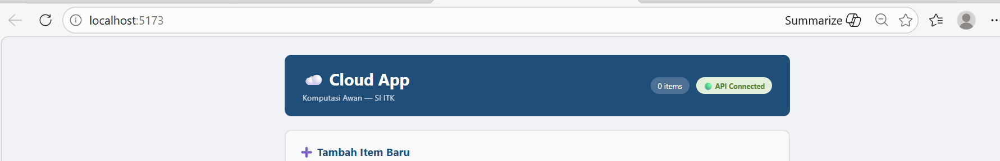
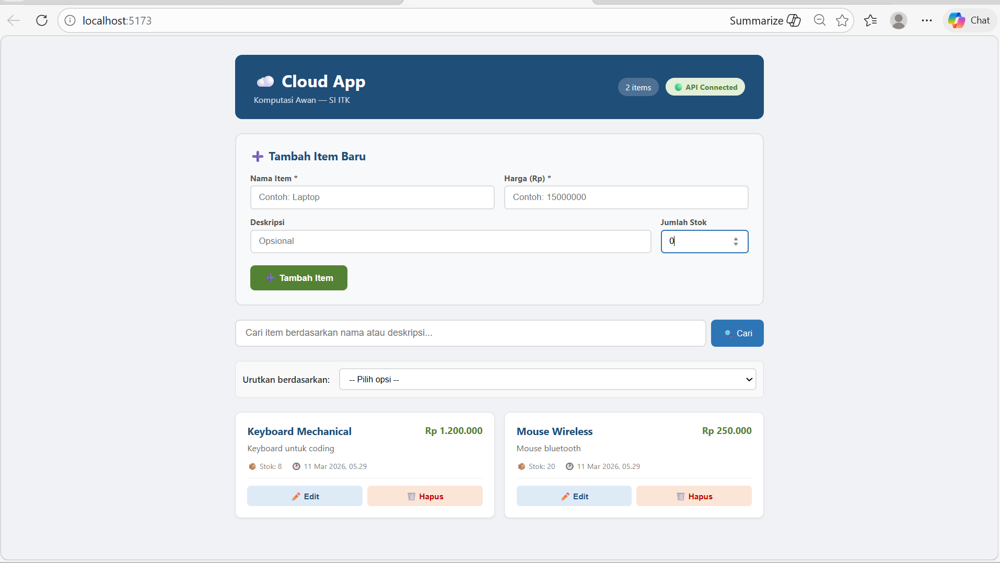
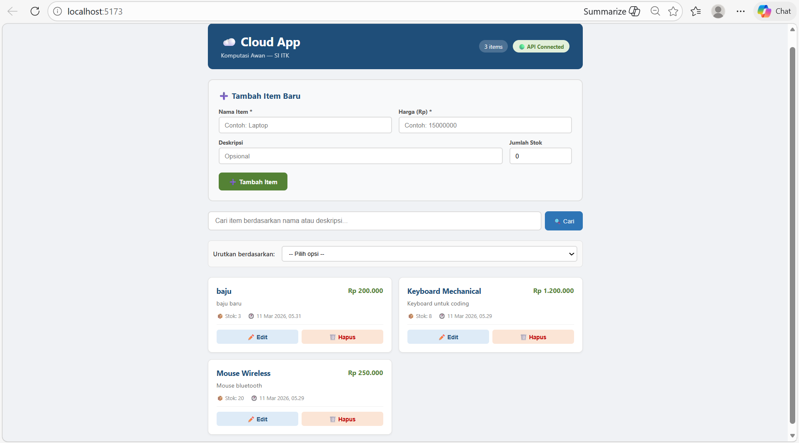
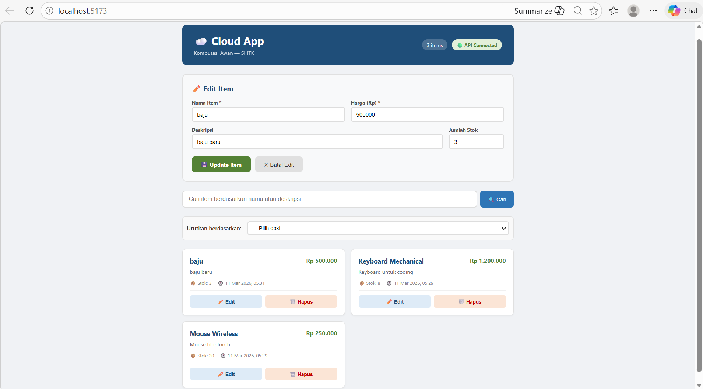
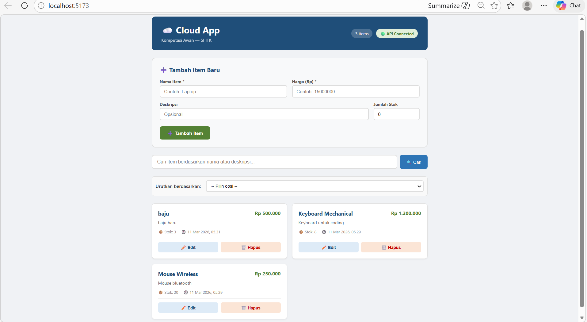
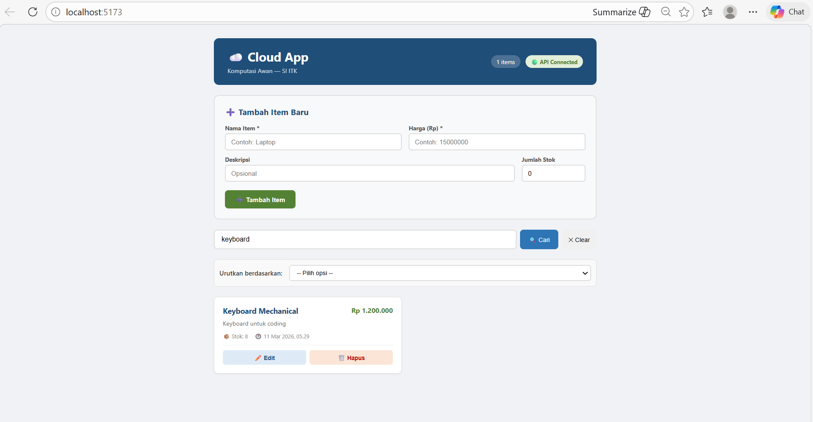
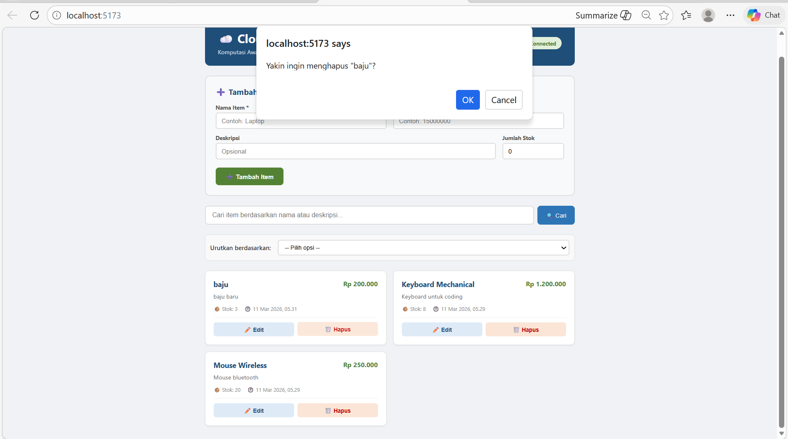
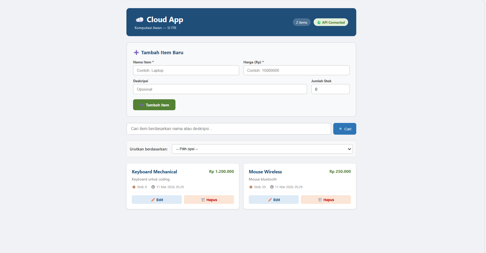
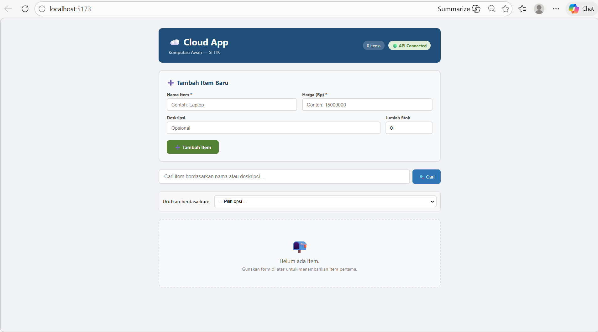

Berikut hasil dokumentasikan 10 test case

---

## 1. Cek status API 

API berhasil terhubung dengan status connected

---
## 2. Verifikasi Data dari Modul 2
Data item dari modul 2 berhasil muncul pada daftar item 

---
## 3. Menambahkan Item Baru 
Item beru berhasil ditambahkan 

---
## 4.  Verifikasi Hasil Penambahan Item 
Item baru yang ditambahkan berhasil muncul pada daftar item 

---
## 5. Fitur Edit Item 
Form edit otomatis terisi dengan data lama dari item 

---
## 6. Update Data Lama 
Perubahan data berhasil 

---
## 7. Mencari Item menggunakan Search Bar
Sistem berhasil menampilkan item yang sesuai dengan kata kunci pencarian 

---
## 8. Menghapus Item 
Dialog konfirmasi penghapus muncul setelah tombol delete 

---
## 9. Verifikasi penghapusan item 
Item berhasil dihapus dari daftar

---
## 10. Empty State
Sistem menampilkan tampilan empty state

---